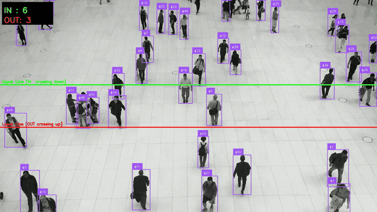
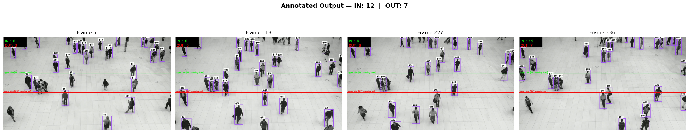
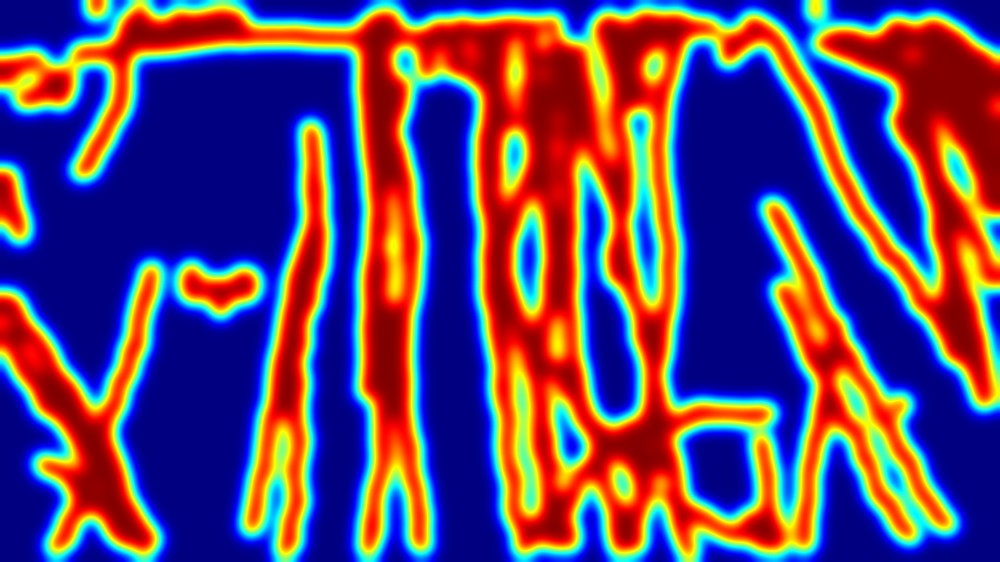
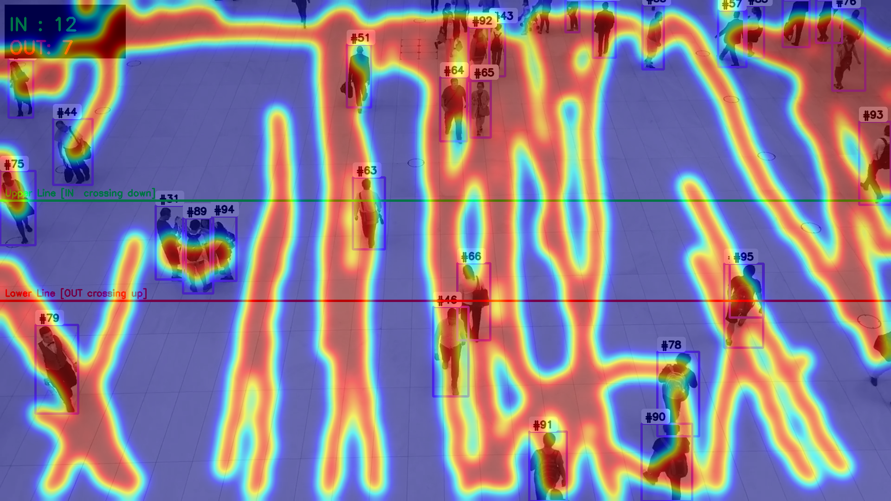
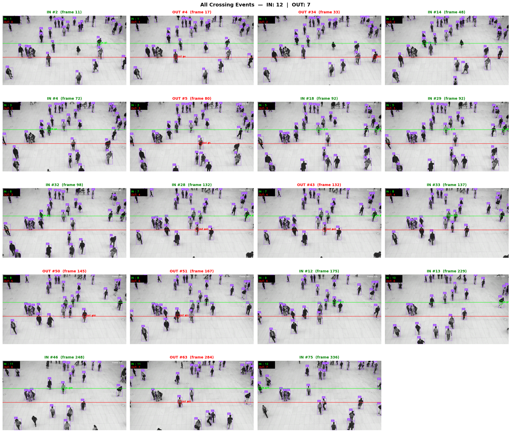

<div align="center">

# People Flow Detection
### Object Tracking · Directional Counting · Heatmap Visualization



[](https://www.python.org/)
[](https://github.com/ultralytics/ultralytics)
[](https://supervision.roboflow.com/)
[](https://opencv.org/)

</div>

---

## What It Does

Processes a video feed to detect, track, and count people crossing two virtual lines — and generates a cumulative foot-traffic heatmap.

- **Detects** every person per frame using YOLOv8n
- **Tracks** each person across frames with a persistent unique ID via ByteTrack
- **Counts** entries (IN) and exits (OUT) using directional line-crossing logic
- **Visualizes** foot-traffic density as a Gaussian-blurred heatmap

---

## Annotated Output Frames

Four frames sampled across the full output video — white ID labels, colour-coded lines, and live counter:



---

## Heatmap

<div align="center">

| Cumulative Foot-Traffic Heatmap | Heatmap Overlaid on Last Frame |
|:---:|:---:|
|  |  |

*Red/yellow = high-density paths &nbsp;·&nbsp; Blue = low-activity zones*

</div>

---

## Crossing Event Verification

Every IN/OUT event logged with frame number and tracker ID — each panel is a single crossing event:



*Green circle = IN &nbsp;·&nbsp; Red circle = OUT*

**Results on `people-walking.mp4` (341 frames · 1920×1080):**

| Metric | Value |
|--------|-------|
| Total IN | **12** |
| Total OUT | **7** |
| Processing speed | ~13 fps (CPU) |

---

## How It Works

### Detection
YOLOv8n runs on every frame, filtering to **class 0 (person)** only.

### Tracking
ByteTrack assigns a **persistent ID** to each person across frames, maintaining identity through occlusions.

### Line Crossing Logic

Two virtual lines defined using [polygonzone.roboflow.com](https://polygonzone.roboflow.com/):

```
Frame height H = 1080 px

  y = 432  (40% H)  ━━━━━━━━━━━━  Upper Line [GREEN]  →  IN
  y = 648  (60% H)  ━━━━━━━━━━━━  Lower Line [RED]    →  OUT
```

Each frame, the previous center-y (`track_prev_y`) is compared with the current center-y:

| Condition | Meaning | Action |
|-----------|---------|--------|
| `prev_y < 432` and `cy >= 432` | Moved **down** past upper line | `in_count += 1` |
| `prev_y > 648` and `cy <= 648` | Moved **up** past lower line | `out_count += 1` |

Each ID is added to a `counted_in` / `counted_out` set — no double-counting.

### Heatmap
A filled circle is painted at each person's center into a `float32` buffer every frame.  
At the end it is Gaussian-blurred and mapped to a JET colormap.

---

## Tech Stack

| Library | Role |
|---------|------|
| [Ultralytics YOLOv8](https://github.com/ultralytics/ultralytics) | Person detection |
| [Roboflow Supervision](https://supervision.roboflow.com/) | ByteTrack, annotators, video I/O |
| [OpenCV](https://opencv.org/) | Frame drawing, heatmap rendering |
| [NumPy](https://numpy.org/) | Heatmap accumulation buffer |
| [Matplotlib](https://matplotlib.org/) | Output visualisation |
| [FFmpeg](https://ffmpeg.org/) | H.264 re-encoding for Colab inline playback |

---

## Project Structure

```
├── people_flow.py                                    # Standalone Python script (CLI)
├── People Flow Detection ... .ipynb                  # Colab / Jupyter notebook
├── demo.gif                                          # Live detection demo
├── sample_frames.png                                 # 4 annotated frames from output video
├── final_heatmap.png                                 # Cumulative heatmap
├── final_heatmap_overlay.png                         # Heatmap blended on last frame
├── crossing_verification.png                         # Every crossing event visualised
└── README.md
```

---

## Quickstart

```bash
pip install ultralytics supervision opencv-python numpy tqdm matplotlib

# Default sample video (auto-downloaded)
python people_flow.py

# Custom video
python people_flow.py --video my_video.mp4 --output result.mp4 --heatmap heat.png
```

**Open directly in Colab:**

[](https://colab.research.google.com/github/MdAsif-Hossain/People-Flow-Detection-using-Object-Tracking-Heatmap-Visualization/blob/main/People%20Flow%20Detection%20using%20Object%20Tracking%20%26%20Heatmap%20Visualization.ipynb)

---

## Customisation

| Parameter | Default | Effect |
|-----------|---------|--------|
| `UPPER_LINE_RATIO` | `0.40` | Move the IN line |
| `LOWER_LINE_RATIO` | `0.60` | Move the OUT line |
| `HEATMAP_RADIUS` | `20` | Footprint size per detection |
| `--video` | CLI flag | Any input video |
| Model | `yolov8n.pt` | Swap to `yolov8s/m/l` for higher accuracy |

---

<div align="center">
Python &nbsp;·&nbsp; YOLOv8 &nbsp;·&nbsp; ByteTrack &nbsp;·&nbsp; OpenCV
</div>
