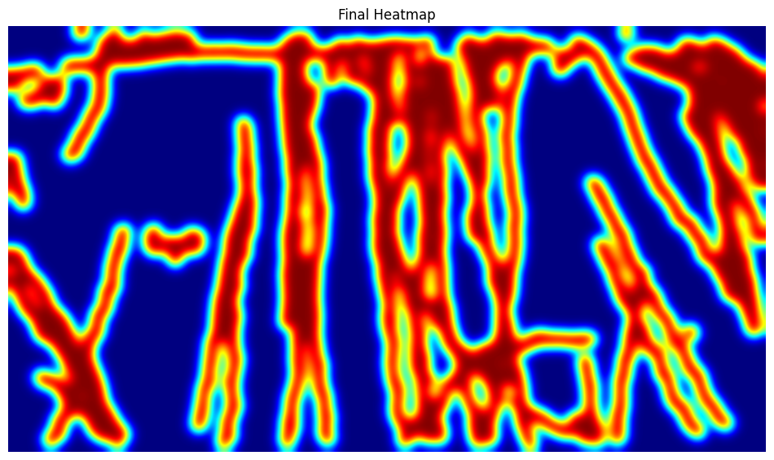

# People Flow Detection using Object Tracking & Heatmap Visualization



## Overview
This is a Computer Vision project that analyzes video feeds to detect, track, and monitor the movement of people in real-time. It extracts actionable spatial and directional intelligence by implementing dual-line crossing logic (for counting in/out traffic) and spatial accumulation mapping (for foot-traffic heatmaps).

## Features
- **Object Detection:** Detects people in a video using the lightweight and fast `YOLOv8n` model.
- **Robust Tracking:** Uses `ByteTrack` (via the `supervision` library) to assign unique tracking IDs to detected individuals across consecutive frames.
- **Directional Counting:** Employs virtual "Upper" and "Lower" boundary lines. It tracks the trajectory of each person's center point to accurately count "IN" (moving downwards across the top line) and "OUT" (moving upwards across the bottom line) traffic.
- **Heatmap Generation:** Accumulates spatial movement data over the entire video and visualizes the highest-density paths using a jet color-mapped Gaussian-blurred heatmap.

## Tech Stack
- **YOLOv8 (Ultralytics):** Deep learning model for rapid object detection.
- **Supervision (Roboflow):** High-level API for object tracking, bounding box annotations, and video frame handling.
- **OpenCV:** Core library for image/video manipulation, drawing virtual lines, counting displays, and rendering the raw heat intensity matrix.
- **Matplotlib:** For rendering the final outputs directly in the notebook environment.

## Prerequisites
To run this project, make sure you have a Python environment set up with Jupyter Notebook support. You can install the required packages using:

```bash
pip install ultralytics supervision opencv-python numpy tqdm matplotlib
```

## How to Run it
1. Open the Jupyter Notebook: `People Flow Detection using Object Tracking & Heatmap Visualization.ipynb`.
2. Run the cells sequentially.
3. The script automatically downloads a sample video (`people-walking.mp4`) to process.
4. The main processing loop iterates frame-by-frame, applying detection, tracking, and metric updates.

## Outputs
Once the notebook completes execution, it generates two main output files in the active directory:
1. `output_flow_tracking.mp4`: A fully annotated video showing bounding boxes, tracking IDs, the virtual line crossings, and a live counter on the screen.
2. `final_heatmap.png` (and the included `Output.png`): A static image showing the cumulative path distribution (heatmap) of all tracked individuals in the scene.

## Customization
If you want to test this on your own video feed:
- Change the `video_url` and `video_path` variables in the first main code cell to point to your local video or desired stream.
- Adjust `upper_line_y` and `lower_line_y` to set custom boundary heights relative to your source video's resolution.